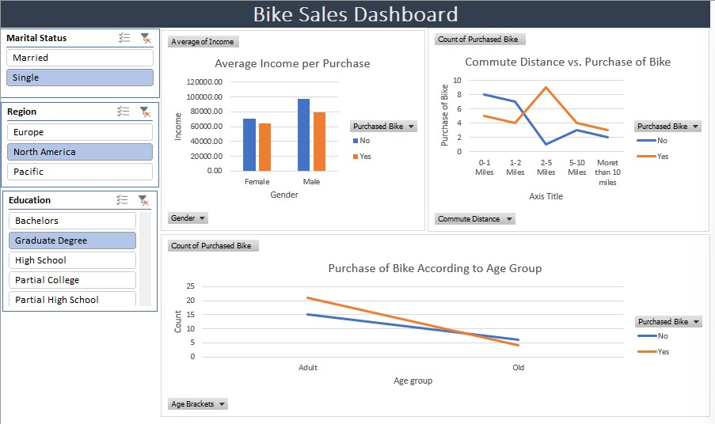

# Bike Sales Data Analysis Dashboard MS Excel Project

## Project Overview
This project involves a comprehensive analysis of customer data for a bike shop. Using Excel, I developed an interactive dashboard to visualize how different demographics (income, age, commute distance) influence bike purchasing decisions.

## Dashboard Preview
 

## Key Features
* **Interactive Slicers:** Allows users to filter data by Marital Status, Region, and Education level.
* **Income Analysis:** A bar chart comparing average income levels between buyers and non-buyers, segmented by gender.
* **Commute Patterns:** A line graph showing the relationship between commute distance and purchase count.
* **Age Demographics:** Tracking sales trends across different age groups.

## How to View
1. Download the `Bike_Sales_Project.xlsx` file from this repository.
2. Open in Microsoft Excel to interact with the slicers.

## Data Source
This dataset is sourced from [Alex The Analyst’s Excel-Tutorial repository](https://github.com/AlexTheAnalyst/Excel-Tutorial).
